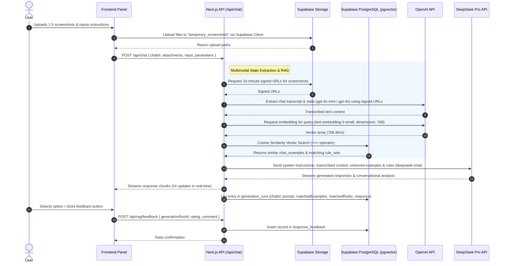

# Technical Design: Conversational RAG Assistant

This document details the architecture, data models, file changes, and implementation strategy for the **Asistente RAG para conversaciones** (Conversational RAG Assistant). The assistant acts as a Spanish conversational/dating coach, utilizing vector similarity search over historical chat examples and custom assistant rule sets to generate tailored response options and conversational analysis in Rioplatense Spanish.

---

## 1. Overall Technical Strategy

The Conversational RAG Assistant transitions the application from a generic prompt-response chatbot to a Retrieval-Augmented Generation (RAG) agent. It employs a multi-tiered AI model configuration:
1. **Multimodal/Vision Extraction**: OpenAI `gpt-4o-mini` or `gpt-4o` extracts transcripts, user intent, and context from uploaded screenshots (1 to 5 files per turn).
2. **Embedding Generation**: OpenAI `text-embedding-3-small` (explicitly configured with `dimensions: 768`) maps both the ingested examples and runtime chat queries to a 768-dimensional vector space.
3. **Generative Synthesis**: DeepSeek Pro (`deepseek-chat`) ingests the system prompt, retrieved historical templates, matched rules, and the extracted conversation state to stream highly stylized responses in Rioplatense Spanish.

The data storage uses **Supabase PostgreSQL** with the `pgvector` extension enabled. Schema migrations and database interactions are managed via **Drizzle ORM**.

For screenshots, a private Supabase Storage bucket (`temporary_screenshots`) retains upload assets temporarily. The Next.js API generates short-lived signed URLs for processing and relies on an automated bucket lifecycle rule to purge screenshots after 24 hours.

---

## 2. Architectural Decisions

### 2.1 Supabase pgvector Extension & Drizzle Migrations
To support semantic vector search, we enable the PostgreSQL `pgvector` extension. In Drizzle ORM, we define a custom Drizzle utility `pgVector` to map arrays of numbers to and from the `vector(768)` database type.

We will create four tables in [schema.ts](file:///C:/Users/Maxim/OneDrive/Escritorio/Proyectos/IA seduccion/lib/db/schema.ts):
* **`chat_examples`**: Contains historical templates with categorical tags, text contexts, last messages, psychological subtext, response options, and a `vector(768)` embedding.
* **`assistant_rule_sets`**: Stores system guidelines (e.g., style, tone restrictions) and matching embeddings.
* **`generation_runs`**: Logs each inference run's prompt, response, matched examples, and matched rules to support auditability.
* **`response_feedback`**: Captures user ratings (upvotes/downvotes) and textual comments linked to specific generation runs.

### 2.2 Private Supabase Storage Bucket for Temporal Screenshots
* **Bucket Setup**: A private bucket named `temporary_screenshots` is provisioned on Supabase.
* **Access Control**: Upload permissions are authenticated; read permissions are restricted. Public access is disabled.
* **Lifecycle Rules**: Objects inside `temporary_screenshots` are configured with a Supabase Storage Lifecycle Rule to automatically delete any files older than 24 hours.
* **Processing Flow**:
  1. Frontend uploads screenshot files (1 to 5) directly using the client-side Supabase client (`@supabase/supabase-js` or `@supabase/ssr` to authenticate).
  2. The server generates a short-lived signed URL (expiry: 10 minutes) for each uploaded screenshot.
  3. The Next.js API route passes these signed URLs to the OpenAI Vision model (`gpt-4o-mini` or `gpt-4o`) to transcribe the conversation history and reconstruct the current dialogue state.

### 2.3 OpenAI & DeepSeek client libraries & API configuration
To support these models, we install the necessary SDK client libraries and load API keys securely.

#### Package Dependencies:
* `@supabase/supabase-js` (version `^2.45.0` or latest) - For storage bucket interaction.
* `@supabase/ssr` (version `^0.5.0` or latest) - For setting up server-side and client-side Supabase client context in Next.js.
* `openai` (version `^4.0.0` or latest) - Official client library for calling OpenAI services (embeddings, vision content extraction, and compatible DeepSeek endpoints).
* `@ai-sdk/openai` (version `^1.1.0` or latest) - OpenAI provider for Vercel AI SDK integration, used for calling OpenAI models and configuring custom compatible endpoints (e.g. DeepSeek).

#### Environment Variables:
All API keys are loaded server-side in API Route Handlers or Actions via Next.js server configuration:
```env
OPENAI_API_KEY=sk-proj-...
DEEPSEEK_API_KEY=sk-...
NEXT_PUBLIC_SUPABASE_URL=https://your-project.supabase.co
NEXT_PUBLIC_SUPABASE_ANON_KEY=eyJhbGci...
SUPABASE_SERVICE_ROLE_KEY=eyJhbGci...
```
* **API Route & Server Context**: Loaded directly using `process.env.OPENAI_API_KEY` and `process.env.DEEPSEEK_API_KEY`.
* **Ingestion Script**: The CLI script (`lib/db/ingest.ts`) loads these keys at startup using `dotenv/config` or `dotenv.config()`.

#### Model Configuration:
* **Vision/Screenshot Extraction (OpenAI)**:
  We use the official `openai` SDK or `@ai-sdk/openai` to invoke `gpt-4o-mini` or `gpt-4o` with image URLs:
  ```typescript
  import { OpenAI } from 'openai';
  const openai = new OpenAI({ apiKey: process.env.OPENAI_API_KEY });
  ```
* **Embeddings (OpenAI)**:
  We call the `text-embedding-3-small` model specifying the target dimensions size of 768:
  ```typescript
  const response = await openai.embeddings.create({
    model: 'text-embedding-3-small',
    input: textToEmbed,
    dimensions: 768,
  });
  const embedding = response.data[0].embedding;
  ```
* **Generation (DeepSeek Pro)**:
  Since DeepSeek Pro exposes an OpenAI-compatible API, we configure the custom provider via Vercel AI SDK or the OpenAI client:
  ```typescript
  import { createOpenAI } from '@ai-sdk/openai';
  
  const deepseek = createOpenAI({
    baseURL: 'https://api.deepseek.com/v1',
    apiKey: process.env.DEEPSEEK_API_KEY,
  });
  const generationModel = deepseek('deepseek-chat');
  ```

### 2.4 Ingestion CLI Script Design
* **Entry Point**: `lib/db/ingest.ts` (mapped to `pnpm ingest:examples`).
* **Workflow**:
  1. Load environment variables via `dotenv`.
  2. Parse the seed file `data/chat-examples.jsonl`.
  3. For each record:
     - Combine `situational_context` and `last_message` into a single string.
     - Call OpenAI's `text-embedding-3-small` (configured to return 768 dimensions) to compute the embedding.
     - Save the example metadata alongside the vector array into the `chat_examples` table.
  4. Seed initial rule sets (e.g., Rioplatense dialect rules) into `assistant_rule_sets` using computed rule text embeddings.

---

## 3. Data Flow

The following sequence details how multimodal user input traverses Supabase, OpenAI, DeepSeek, and the PostgreSQL vector search to generate suggested answers and capture feedback:



---

## 4. File Changes List

The following list identifies the specific files to be created or modified:

| Action | File Path | Role / Description |
| :--- | :--- | :--- |
| **Modify** | `lib/db/schema.ts` | Define `chat_examples`, `assistant_rule_sets`, `generation_runs`, and `response_feedback` schemas. Configure the custom `pgVector` type. |
| **Modify** | `lib/db/queries.ts` | Implement similarity search function using `pgvector` distance operators, feedback storage functions, and run logging query functions. |
| **Create** | `lib/db/ingest.ts` | Ingestion command script reading JSONL dataset, requesting embeddings using OpenAI's embedding API, and seeding tables. |
| **Create** | `lib/ai/rag-search.ts` | Orchestrator query service interfacing between text input, OpenAI embedding requests, and vector database retrieval. |
| **Modify** | `lib/ai/providers.ts` | Register the OpenAI and DeepSeek Pro providers, configuration settings, and model initializations. |
| **Modify** | `lib/ai/prompts.ts` | Update prompts to guide the coach model, providing structures for context injection and Rioplatense dialect constraints. |
| **Modify** | `lib/types.ts` | Add TypeScript interfaces for feedback, generation parameters, and run metadata. |
| **Modify** | `components/multimodal-input.tsx` | Enforce 1-5 screenshot constraints, hook up file uploads to Supabase storage, and handle progress states. |
| **Create** | `components/rag-assistant-panel.tsx` | UI container displaying the Conversational Analysis Card, tactical advice, applied rules, and suggested response option buttons. |
| **Create** | `components/feedback-button.tsx` | Upvote/downvote buttons and dialog pop-ups to capture feedback comments. |
| **Modify** | `app/(chat)/api/chat/route.ts` | Update POST route to handle screenshot resolution, OpenAI Vision extraction, RAG vector searches, system prompt construction, and run metadata writing. |
| **Create** | `app/(chat)/api/rag/search/route.ts` | Endpoint allowing manual template indexing and search from the client side. |
| **Create** | `app/(chat)/api/rag/feedback/route.ts` | Endpoint capturing positive/negative ratings and text comments, logging them in `response_feedback`. |
| **Modify** | `package.json` | Install `@supabase/supabase-js`, `@supabase/ssr`, `openai`, `@ai-sdk/openai`, and register the `pnpm ingest:examples` command. |

---

## 5. API Interfaces & Data Structures

### 5.1 System Database Schema Contracts (Drizzle)

```typescript
import { pgTable, uuid, text, timestamp, boolean, jsonb } from 'drizzle-orm/pg-core';
import { customType } from 'drizzle-orm/pg-core';
import { chat } from './schema'; // Assuming reference to existing chat table

// Custom pgvector type mapping for 768-dimension vectors
export const pgVector = customType<{ data: number[] }>({
  dataType() {
    return 'vector(768)';
  },
  toDriver(value: number[]): string {
    return `[${value.join(',')}]`;
  },
  fromDriver(value: unknown): number[] {
    if (typeof value === 'string') {
      return value.slice(1, -1).split(',').map(Number);
    }
    return value as number[];
  }
});

// Chat Examples Table (RAG Source Store)
export const chatExamples = pgTable('chat_examples', {
  id: uuid('id').primaryKey().defaultRandom(),
  category: text('category').notNull(),
  situationalContext: text('situational_context').notNull(),
  lastMessage: text('last_message').notNull(),
  psychologicalSubtext: text('psychological_subtext').notNull(),
  options: jsonb('options').$type<string[]>().notNull(),
  embedding: pgVector('embedding').notNull(),
});

// Assistant Rule Sets Table (RAG Guideline Store)
export const assistantRuleSets = pgTable('assistant_rule_sets', {
  id: uuid('id').primaryKey().defaultRandom(),
  name: text('name').notNull().unique(),
  rules: text('rules').array().notNull(),
  embedding: pgVector('embedding').notNull(),
  createdAt: timestamp('createdAt').defaultNow().notNull(),
});

// Generation Runs Table (Audit Log)
export const generationRuns = pgTable('generation_runs', {
  id: uuid('id').primaryKey().defaultRandom(),
  chatId: uuid('chatId').references(() => chat.id).notNull(),
  prompt: text('prompt').notNull(),
  response: text('response').notNull(),
  matchedExamples: jsonb('matchedExamples').notNull(), // Array of { id, similarity, category }
  matchedRules: jsonb('matchedRules').notNull(),       // Array of { id, name }
  createdAt: timestamp('createdAt').defaultNow().notNull(),
});

// Response Feedback Table (Feedback Loop)
export const responseFeedback = pgTable('response_feedback', {
  id: uuid('id').primaryKey().defaultRandom(),
  generationRunId: uuid('generationRunId').references(() => generationRuns.id).notNull(),
  rating: boolean('rating').notNull(), // true = upvote, false = downvote
  comment: text('comment'),
  createdAt: timestamp('createdAt').defaultNow().notNull(),
});
```

### 5.2 API Payloads

#### `POST /api/chat`
```typescript
interface ChatGenerationPayload {
  id: string; // chatId
  message: {
    id: string;
    role: 'user';
    parts: Array<
      | { type: 'text'; text: string }
      | { type: 'file'; url: string; name: string; mediaType: string }
    >;
  };
  selectedChatModel: string;
  selectedVisibilityType: 'public' | 'private';
  ragParameters?: {
    platform: string; // Tinder, Bumble, WhatsApp, etc.
    category: string; // Openers, flirting, setting dates
    objective: string;
    style: string;
    intensity: 'low' | 'medium' | 'high';
    length: 'short' | 'medium' | 'long';
    mode: 'automatic' | 'specific';
  };
}
```

#### `POST /api/rag/feedback`
```typescript
interface FeedbackPayload {
  generationRunId: string;
  rating: boolean; // true = upvote, false = downvote
  comment?: string; // Optional user commentary
}
```

#### Response Stream Format (`SSE`)
The endpoint will stream response tokens. Along with text tokens, the stream will emit a metadata packet containing the structured analysis card data and the generation run ID:
```json
{
  "type": "rag-metadata",
  "data": {
    "generationRunId": "d3b07384-d113-4c92-a1f9-9cc8cfb8813a",
    "conversationalAnalysis": {
      "contextAnalysis": "Resumen del estado de la conversación...",
      "psychologicalSubtext": "Intenciones subyacentes...",
      "appliedRules": ["Regla 1", "Regla 2"],
      "tacticalAdvice": "Consejo táctico..."
    },
    "responseOptions": [
      "Opción 1 en Rioplatense...",
      "Opción 2 en Rioplatense..."
    ]
  }
}
```

---

## 6. Testing Strategy

All systems and components introduced must be verified through unit, integration, and E2E testing using Playwright.

### 6.1 Unit & Integration Testing
* **Database Unit Tests**:
  - Test custom `pgVector` type serialization and deserialization.
  - Test similarity queries (`findSimilarExamples`) against mock embeddings to ensure correct sorting and SQL mapping.
* **CLI Ingestion Testing**:
  - Verify that the ingestion script parses JSONL files correctly, retries embedding calculations in case of API failures, and seeds the database correctly.
* **Prompt Assembly Tests**:
  - Test the prompt compiler to ensure that variables (retrieved context, user selectors) are formatted into the system prompt, and Rioplatense instructions are consistently included.

### 6.2 End-to-End Testing (Playwright)
* **Scenario 1: Upload Limit Verification**
  - Add 6 sample PNGs to the attachment field.
  - Assert that the 6th upload is blocked and an alert is shown: `"Límite superado: podés subir un máximo de 5 capturas de pantalla."`
* **Scenario 2: RAG Pipeline Execution**
  - Seed mock data in `chat_examples`.
  - Simulate uploading 3 screenshots, set target parameters (Tinder, casual conversation, short, funny), and click send.
  - Intercept the LLM query payload to verify that signed URLs are included and that similar examples are injected.
  - Assert that the RAG panel displays the analysis card, applied rules, and suggested response options.
* **Scenario 3: Feedback Loop Logging**
  - Click the upvote button on option 1. Assert that a POST requests `/api/rag/feedback` with `rating: true` and that a success toast appears.
  - Click the downvote button, type `"Suena artificial"`, and click submit. Assert that `/api/rag/feedback` receives `rating: false` and `comment: "Suena artificial"`.
  - Assert that both feedback events are persisted in the database.
